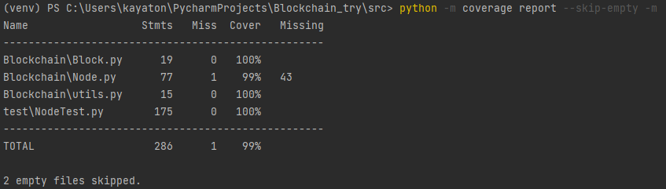
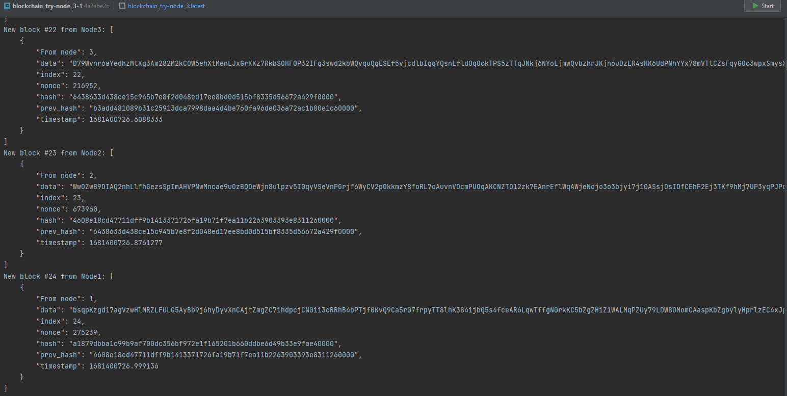

# Blockchain

## Тесты

Ветка `main`: 

Ветка `develop`: 

*   Покрытие

#### Requirements: `requirements.txt`

## Запуск

#### 1. Клонирование репозитория
`https://github.com/11-kt/Blockchain_try.git`

#### 2. Папка проекта

`cd Blockchain_try`

#### 3. Сборка docker-compose
`docker-compose build`

#### 4. Запуск docker-compose
`docker-compose up`

## Результаты
Node1 (port: `11110`) генерирует genesis и отправляет на Node2 (port: `11111`) и Node3 (port: `11112`). Далее начинается генерация блоков и обмен.

Ниже представлено состояние цепи для каждого блока (видно, что блоки приходят от разных нод).

* Node1:

* Node2:

* Node3:

## License
[Apache](./LICENSE)